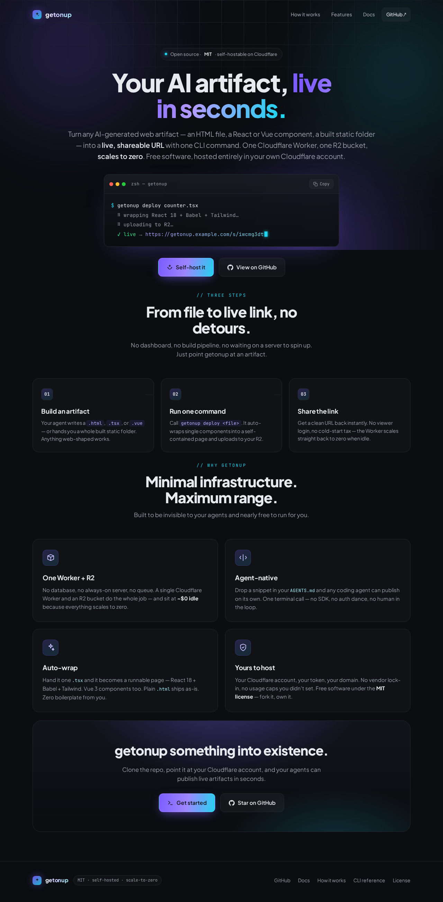
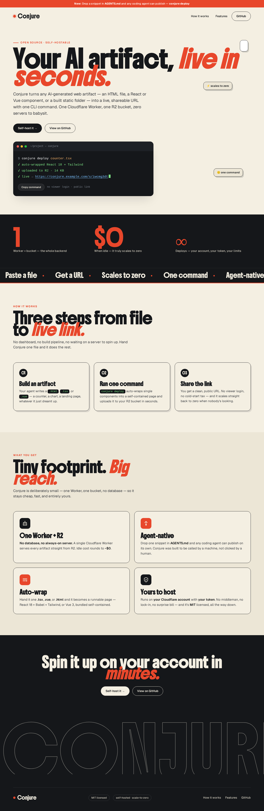
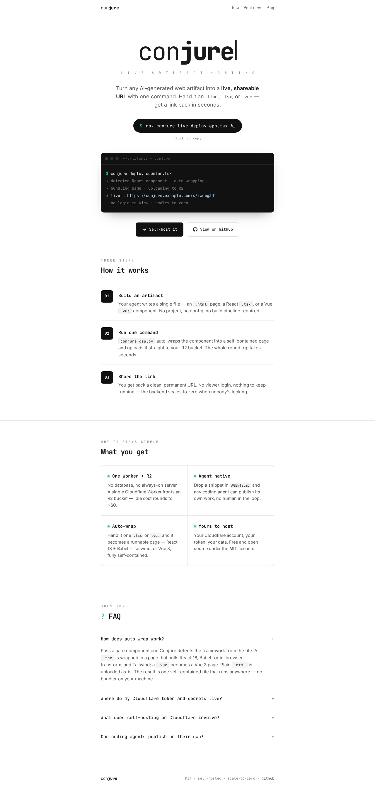
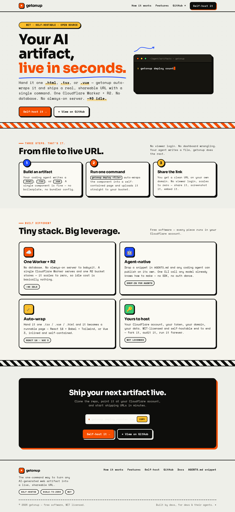
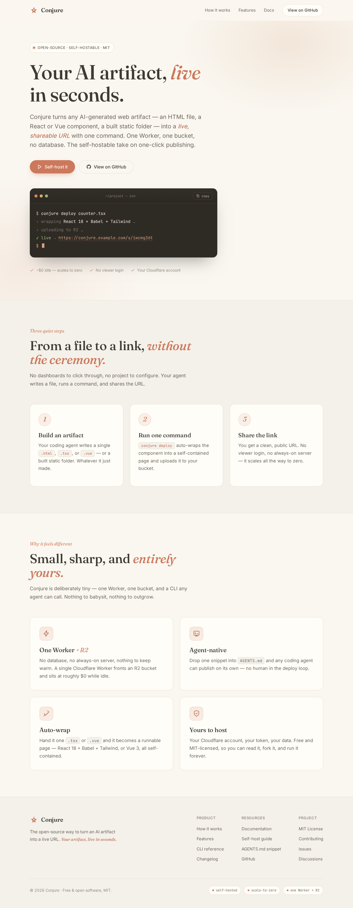

# Conjure — landing page designs

Five landing-page directions for Conjure, each a complete self-contained HTML file in
[`landings/`](./landings). They were **generated and then deployed through Conjure's own CLI** —
so this whole thing is a live demo of the product (an AI artifact → a live URL, one command).

A **gallery** ties them together: it's a single page (itself a multi-file deploy: index + five
thumbnails) that links to every design. It's the current homepage.


## View them live

```bash
npm run dev        # http://localhost:8787  → the gallery, with links to all five
```

| Page | Source | Live (local) |
|---|---|---|
| **Gallery** (homepage) | `gallery/` | http://localhost:8787/ · /s/xr8q6ykn |
| Midnight (house style) | `landings/midnight.html` | /s/32c7whv2 |
| Scanini | `landings/scanini.html` | /s/tunyekjr |
| Shellshare | `landings/shellshare.html` | /s/y3ynsckc |
| PostHog | `landings/posthog.html` | /s/4dtxiaem |
| Claude | `landings/claude.html` | /s/gurjmsk7 |

> IDs are from local deploys (they persist in `.wrangler`). If you clear local state or deploy
> to real Cloudflare, redeploy and the gallery links update accordingly:
> ```bash
> CONJURE_URL=http://localhost:8787 CONJURE_TOKEN=dev-local-token-abc123 \
>   node cli/dist/index.js deploy landings/midnight.html --name "Conjure"
> ```

**Make a single design the homepage** (instead of the gallery):

```bash
cp landings/<key>.html server/public/index.html      # midnight | scanini | shellshare | posthog | claude
# to restore the gallery as the homepage:
cp gallery/index.html server/public/index.html && cp gallery/thumbs/*.png server/public/thumbs/
```

---

## 1. Midnight — the Conjure house style 🌌

Deep near-black, violet→cyan ambient glow, glassy panels, a blinking-caret terminal,
"materialize" reveals. Premium and a little magical.



## 2. Scanini — `scanini.app` style ◼︎

Cream paper, a huge Boldonse display serif with a red italic accent, sticker motifs, a dark
stats band, an auto-scrolling marquee, and a giant outlined "CONJURE" wordmark.



## 3. Shellshare — `shellshare.net` style ▕

Minimal hacker-docs: white, a monospace wordmark, a spaced "LIVE ARTIFACT HOSTING" tagline,
the deploy command as a pill, dark terminal blocks, and a tidy FAQ.



## 4. PostHog — bold, playful, dev-native 🟠

Cream canvas, thick black sticker-cards, coral + blue + yellow accents, monospace, hard-edged
feature grid. Confident and fun.



## 5. Claude — warm, editorial, calm ☕️

Warm cream, serif display with italic terracotta accents, generous whitespace, soft and human.


