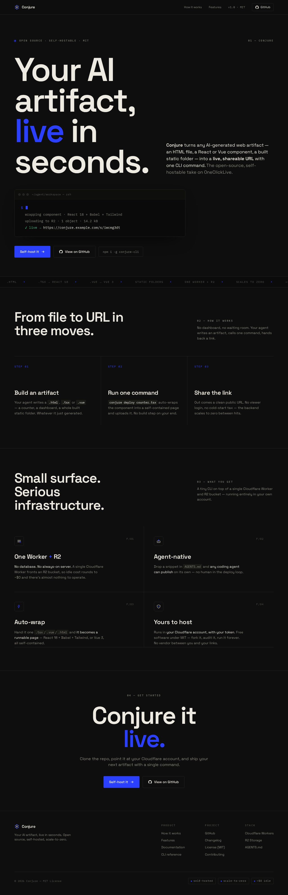

# Conjure — landing page designs

Four landing-page directions for Conjure, each a complete self-contained HTML file. They were
**generated in parallel and then deployed through Conjure's own CLI** to the local server — so
this page is itself a demo of the product (an AI artifact → a live URL, one command).

The polished **Midnight** direction is the current default homepage (`server/public/index.html`).
To switch the homepage to any other option:

```bash
cp landings/<key>.html server/public/index.html   # then redeploy / restart wrangler dev
```

## View them live

Start the server and open the URLs (IDs are stable — they persist in local R2):

```bash
npm run dev        # http://localhost:8787  (the Midnight design is the homepage)
```

| Design | Source | Live (local) |
|---|---|---|
| Midnight (house style) | `landings/midnight.html` | http://localhost:8787/s/g8ykptg5 |
| PostHog style | `landings/posthog.html` | http://localhost:8787/s/aig7n3wd |
| Claude style | `landings/claude.html` | http://localhost:8787/s/rfgck3dn |
| Studio minimal | `landings/studio.html` | http://localhost:8787/s/f46sq2w9 |

If the IDs ever change (e.g. you cleared `.wrangler`), just redeploy them:

```bash
CONJURE_URL=http://localhost:8787 CONJURE_TOKEN=dev-local-token-abc123 \
  node cli/dist/index.js deploy landings/midnight.html --name "Conjure"
```

---

## 1. Midnight — the Conjure house style 🌌

Deep near-black canvas, violet→cyan ambient glow, glassy panels, a blinking-caret terminal,
"materialize" reveals. Premium and a little magical. **This is the default.**


## 2. PostHog style — bold, playful, dev-native 🟠

Cream canvas, thick black sticker-cards, coral + blue + yellow accents, monospace, doodle
energy, hard-edged feature grid. Confident and fun.


## 3. Claude style — warm, editorial, calm ☕️

Warm cream, serif display with italic terracotta accents, generous whitespace, soft and
human. Reads like a calm, well-made object.


## 4. Studio minimal — refined Swiss/editorial ◾️

_(My read of the "Scanini" cue — point me at the real reference if I guessed wrong.)_ Near-
monochrome, oversized display type, strict grid, a single electric-blue accent, gallery-grade
restraint.


